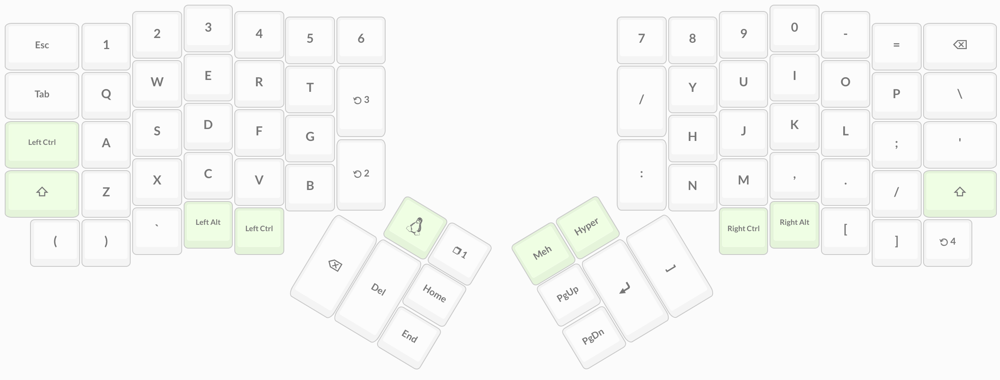

# Ergodox layout

This repo tracks the key layout I use for my [ergodox-ez](https://ergodox-ez.com/). It aims to provide a seamless experience between MacOS and Linux based OS's by keeping the differences at a minimum and the switch between both as easy as possible.

Currently I use [oryx](https://ergodox-ez.com/pages/oryx) to manually configure the layout, which I found to be enough for my current needs. Due to this, you may find the `keymap.c` file weirdly formatted, as it's just an export obtained from oryx.

## Layers

I'm a big fan of sitting on the couch with my laptop, so I want the overhead between using the ergodox and using the laptop keyboard to be as minimal as possible. Too much overhead on these kind of things takes away attention from the more important things, such as actual work. Therefore, my base layouts are pretty much emulating the layout I'm able to have on the laptop.

### 1. MacOS

The main difference between this layout and the one you can find on any macbook is the positioning of some keys I use very regularly for coding, such as `:`, `space`, `return`, etc. Other than that, the layout is pretty intuitive even for someone who's never used an ergodox and is used to the `US International MacOS` layout.

### 2. Linux

Compared to the MacOS layer, the only difference is that `Cmd` has been replaced by `Alt` and `Option` has been replaced by `Meta`. I don't really consider them proper substitutes and I'm working on a better option for this.

### 3. Code

The code layer gives easy access to keys mostly used for coding. It's marked as the second layer and the toggle key is positioned right next to those keys, so pressing them feels like hitting `Shift+Key`.

Some niceties are included in this layer as well. For example, the left thumb provides easy access to media control keys which I mostly use to "operate" the Spotify app. Also, the keyboard on the right provides access to movement keys which emulate the vim ones, so moving within and out of vim should be mostly the same experience.

### 4. Numpad

Sometimes it gets annoying to press the number keys one by one on the top line of the keyboard. There's a reason numpads were invented, so I've decided to simply add an extra layer just for this. Workflows heavily dependent on number writing benefit greatly from using this layer.

### 5. Mouse

Finally, I've also added an easy way to control the cursor on the screen. Obviously I don't use this often due to the lack of practicality and because I own an actual computer mouse. The motivation behind this layer is that at one point in my life I owned a raspberry pi without owning a computer mouse (only had an apple's trackpad), so I briefly used this layer to setup remote access to the raspberry pi. I also sometimes use it when my mouse/trackpad runs out of battery.

## Building and Flashing

TODO
